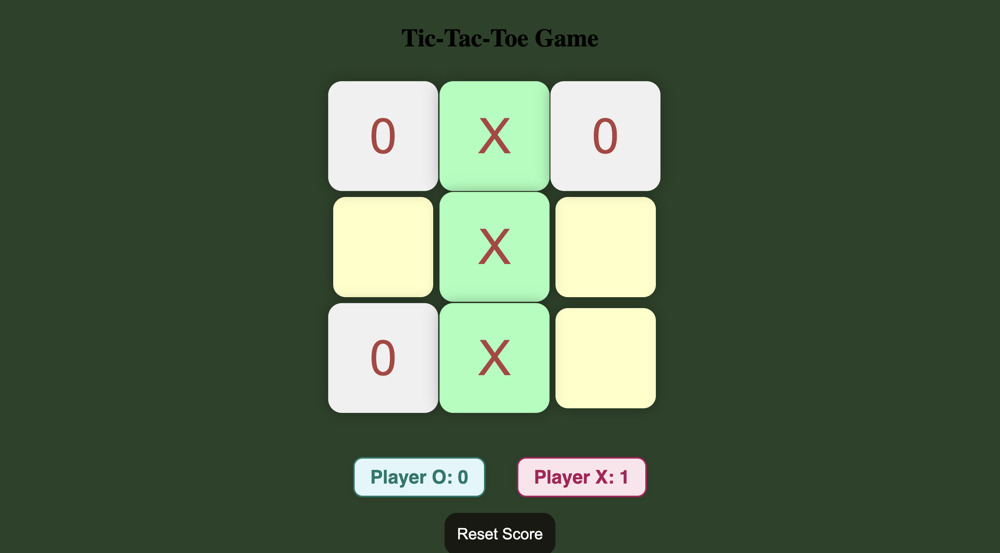

# 🎮 Tic-Tac-Toe Game

A fun and interactive Tic-Tac-Toe game with **animations, sounds, and a custom UI**.  
Built by following a YouTube tutorial, with **additional features and personal improvements** added.

---

## 🔹 Features
- Player vs Player gameplay  
- Custom UI with animated boxes  
- Scoreboard for Player X and Player O  
- Sounds for clicks, wins, and draws  
- Reset score and start a new game functionality  
- Responsive design

---

## 🖼️ Screenshot / Demo
  

---

## 🛠️ Tech Stack
- HTML  
- CSS  
- JavaScript  
- Audio integration
